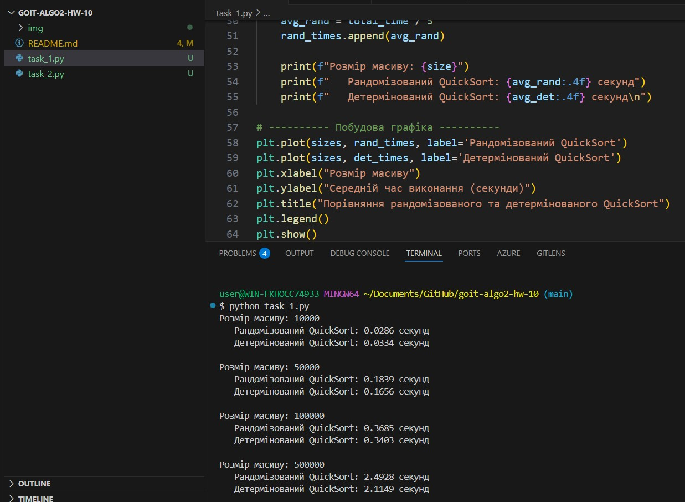
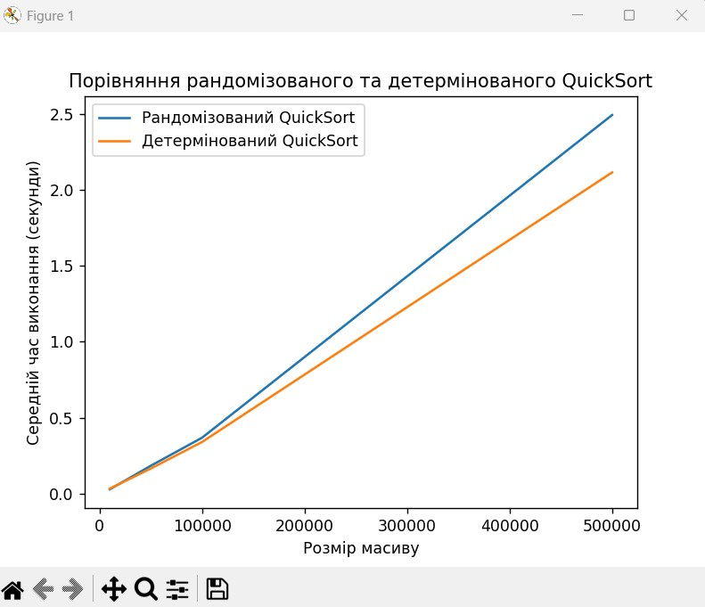
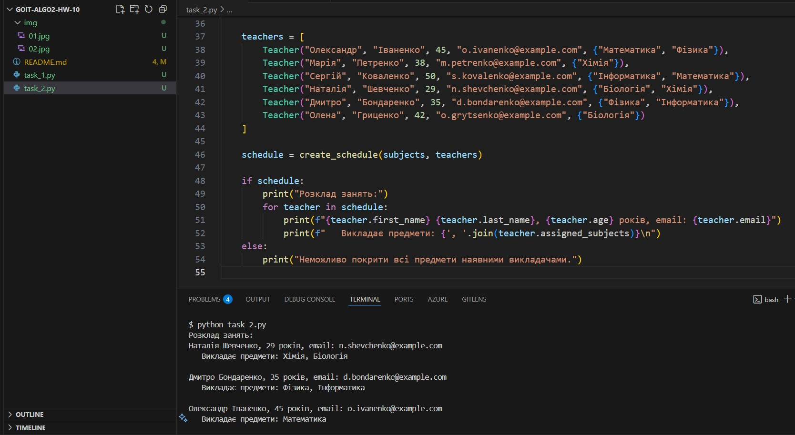

# goit-algo2-hw-10

Алгоритмічна складність, наближені та рандомізовані алгоритми

Цей проєкт складається з двох незалежних завдань:

Порівняння рандомізованого та детермінованого алгоритму QuickSort з вимірюванням часу виконання та побудовою графіків.

Складання розкладу занять за допомогою жадібного алгоритму для задачі покриття множини.

## Завдання 1 Порівняння QuickSort

Мета: реалізувати два варіанти QuickSort:

Детермінований – вибір опорного елемента за фіксованим правилом (середній елемент).

Рандомізований – випадковий вибір опорного елемента.

Кроки виконання:

Створити функції:

deterministic_quick_sort(arr)

randomized_quick_sort(arr)

Згенерувати масиви розмірів: 10_000, 50_000, 100_000, 500_000.

Заповнити масиви випадковими числами.

Для кожного масиву виконати сортування обома алгоритмами по 5 разів і знайти середній час.

Вивести результати у вигляді таблиці в терміналі.

Побудувати графік порівняння часу виконання з підписами осей та легендою.

### Запуск:

python task_1.py

Результат:

Таблиця в терміналі із середнім часом.

Графік з порівнянням швидкості.

## Завдання 2 Жадібний алгоритм для складання розкладу

Мета: мінімізувати кількість викладачів, щоб покрити всі предмети.

Дані:

Множина предметів: {'Математика', 'Фізика', 'Хімія', 'Інформатика', 'Біологія'}

Список викладачів з віком, email та предметами, які вони можуть викладати.

Алгоритм:

Використати жадібний підхід:

На кожному кроці вибирати викладача, який може викладати найбільше ще непокритих предметів.

Якщо є декілька з однаковим покриттям — обрати наймолодшого.

Якщо після відбору предмети залишаються непокритими — вивести повідомлення про неможливість складання розкладу.

Інакше — вивести список викладачів та предметів, які їм призначено.

### Запуск:

python task_2.py

### Результат:

Якщо розклад можливо скласти — друк списку викладачів та предметів у термінал.

Якщо неможливо — відповідне повідомлення.

Висновки
QuickSort: рандомізований варіант у середньому трохи швидший на великих масивах завдяки зменшенню ймовірності вибору невдалого опорного елемента.

Жадібний розклад: дозволяє швидко отримати оптимальне або близьке до оптимального рішення без повного перебору варіантів.

